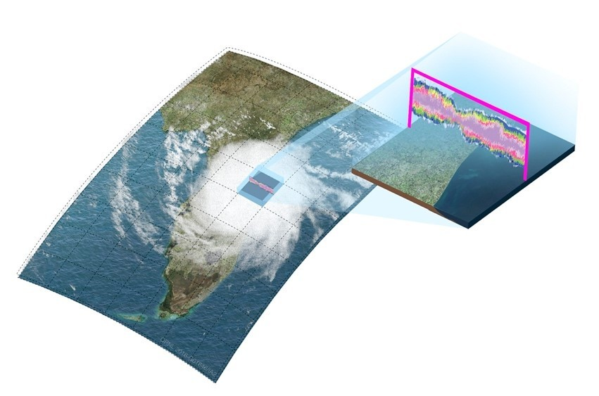
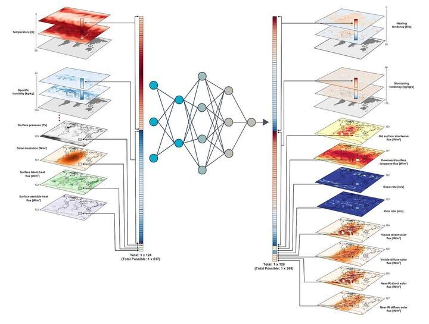

# Climate Simulation - Atmospheric Physics using AI

Hosted on [Kaggle](https://www.kaggle.com/competitions/leap-atmospheric-physics-ai-climsim) by [LEAP](https://leap.columbia.edu/), the task is to develop ML models that emulate atmospheric processes, such as storms, clouds, turbulence, rainfall and radiation, within a climate model (E3SM-MMF). This climate model is exceptionally accurate but its operational cost is too high to be used for climate prediction. 

The objective was to create an efficient ML model to replace an expensive submodule of the climate model, potentially transforming climate prediction by significantly reducing operational costs. 

# Project Highlights

- I engineered a novel ML architecture that quickly ascended to the top of the competition leaderboard, maintaining Rank 1 for the first three weeks.
- Recognizing that overfitting on the competition’s low-resolution dataset (175 GB) was the primary bottleneck, I shifted focus to preparing and processing a much larger high-resolution dataset (41 TB). To illustrate the scale of this dataset, it’s equivalent to handling ~**10 million HD movies** or ~**30 times** the data used to train LLaMA 3.
- Google TRC’s generous grant of TPUs worth $600,000 enabled and accelerated the project.
- I built an efficient data pipeline using TensorFlow Datasets (TFDS) and distributed computing to download, process, and stream the dataset.
- With Jax, and on top of [google/MaxText](https://github.com/google/maxtext), I developed a high-performance, highly scalable training pipeline needed for the project.
- I achieved an R² score of 0.84 on the high-resolution dataset, which is impressive compared to the top teams on Kaggle's competition leaderboard (with top scores around 0.79). Though the datasets are different, I followed the same test set structure of the competition.

# Insights

The ultimate goal of the competition and my project was long-term weather prediction but every model everyone made fell short of this goal. Why?

This dataset consists of data that is used to predict weather 20 minutes into the future. For long-term weather prediction, the models are made to run in a loop, making predictions on top of predictions. A 5-day weather forecast requires the model to predict 20 minutes ahead, 360 times in a row. But with every prediction having an error rate of > 0.16, the cumulative error will likely make the long-term prediction useless.

After digging deep into the E3SM-MMF climate simulation model and its cloud-resolving module (CRM), I’ve identified areas where we can enhance the dataset, which could bring us closer to building a model capable of replacing the MMF approach.
- The MMF model chops the globe into grid cells, and each cell has its own CRM that simulates conditions in its specific area. These individual CRMs work with a 10-second internal timestep, while global calculations happen every 20 minutes. I strongly believe using this “intermediate data” is the key to the next breakthrough and the easiest next step.
- Each individual CRM isn’t just a generic model; they’re initialized with unique constants based on their location. My experiments showed that these constants can be approximated if the grid cell positions are provided as inputs, but the competition structure doesn’t allow us to use these positions. This forces us to train models with “incomplete” input. Having these constants in the input vector will help make the training more stable and improve the overall performance.
  
# Repository Structure

This repository has 3 branches - 

* [main](https://github.com/Joy-Lunkad/climsim-max/tree/main) - Test set structure follows kaggle competition's constraints
* [grid](https://github.com/Joy-Lunkad/climsim-max/tree/grid) - I use grid cell positions as additional input
* [haiku](https://github.com/Joy-Lunkad/climsim-max/tree/haiku) - Using haiku, without support for TPU pods, only climsim low-res dataset.   

